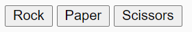

# Rock Paper Scissors
Rock paper scissors is a hand game usually played between two people, in which each player simultaneously forms one of three shapes with an outstretched hand. These shapes are rock, paper, and scissors. 

Rock paper scissors is often used as a fair choosing method between two people, similar to coin flipping, drawing straws, or throwing dice in order to settle a dispute or make an unbiased group decision. Unlike truly random selection methods, however, rock paper scissors can be played with a degree of skill by recognizing and exploiting non-random behavior in opponents.

 

placeholder img 

link to project 

 
 
 

# Table of Contents

1. ### Introduction 

2. ### Features

3. ### Testing
    * Bugs
    * Validator Testing 

4. ### Deployment
    * Deploying on GitHub Pages 

5. ### Credits

 
 
 

# Introduction 
 
 

# Features

### Rules
* Header
  
  * Sits at the top of the page, the header shows the games name: Rock Paper Scissors
  
  * This header clearly tells the user what game they are playing

  

* Game Options

   * The game options include a clear instruction and then a choice of options to choose from to play Rock Paper Scissors. these options are interactive buttons that the user can click to make their choice. 

    

* The Game Result

   * 
 
 

# Testing 
* Bugs 
* Validator Testing

 
 

# Deployment

 
 

# Credits 
* https://www.w3schools.com

* Google Fonts

* Font Awesome

* Definition of Rock, Paper, Scissors taken from Wikipedia

 
 

# Media 

*  The images for cartoon hands were taken from Google Images
 

